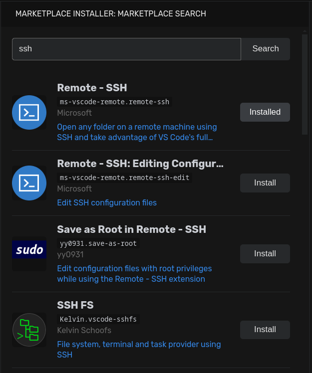

# VSCode Marketplace Extensions Installer

## 🚀 Overview

The **VSCode Marketplace Extensions Installer** is a powerful VS Code extension designed to simplify the process of installing extensions from the Visual Studio Marketplace, especially for users of VSCodium or similar environments that don't have direct marketplace access. It leverages a custom Python tool (`vsix-to-vscodium`) to seamlessly install extensions, providing a familiar search and install experience directly within your editor.

## ✨ Features

* **Integrated Marketplace Search:** Search for any extension available on the Visual Studio Marketplace directly from a dedicated sidebar view.

* **One-Click Installation:** Easily install extensions with a single click after finding them in the search results.

* **Intelligent Installation Status:** Automatically detects if an extension is already installed.

* **Command Palette Integration:** For quick installations, use the `Marketplace: Install VS Code Extension by ID` command to install an extension by its full ID (e.g., `publisher.extension-name`).

### Screenshots

## 📋 Requirements

* **Python 3.x:** This extension requires a Python 3.x installation on your system, as it uses Python for its core installation logic. The extension will attempt to find `python3` or `python` in your PATH.

## ⬇️ How Downloads Work

When you install an extension using the Marketplace Extensions Installer, the process is handled transparently:

1.  The extension first checks for a Python 3.x installation on your system.

2.  It then sets up a dedicated, isolated Python virtual environment within your VS Code extension's global storage.

3.  Inside this virtual environment, the core `vsix-to-vscodium` tool is installed from a local copy bundled directly within this extension. This ensures that all necessary components are self-contained and ready to use without any additional manual downloads or configurations on your part.

4.  Finally, the `vsix-to-vscodium` tool is used to download the `.vsix` package of your chosen extension from the Visual Studio Marketplace and install it into your VS Code (or VSCodium) environment.

## 🐛 Known Issues

* **Unofficial Marketplace API:** This extension uses an unofficial, internal API endpoint of the Visual Studio Marketplace. This API is not documented and may change without notice, potentially breaking the search functionality.

* **Broad Query Timeouts:** Very broad search queries (e.g., "theme") might occasionally lead to timeouts or `500 Internal Server Error` responses from the marketplace API due to the large number of results. Try a more specific search term if this occurs.

## 🙏 Acknowledgements

A huge thank you to **Uche Ozoemena (duncthelunk)**, the original developer of the `vsix-to-vscodium` tool. This extension heavily relies on his excellent work for the core installation functionality. You can find his repository here: <https://github.com/CodeWithOz/vsix-to-vscodium>.